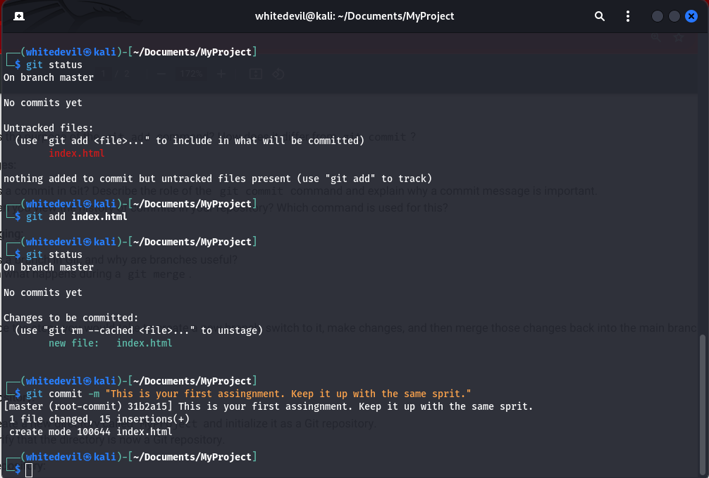
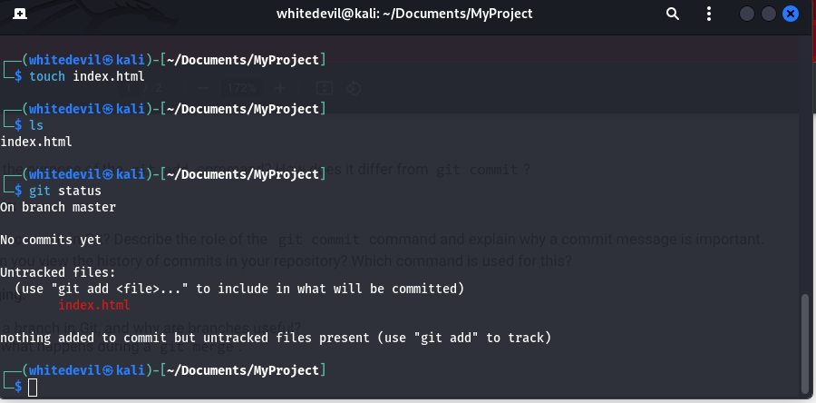
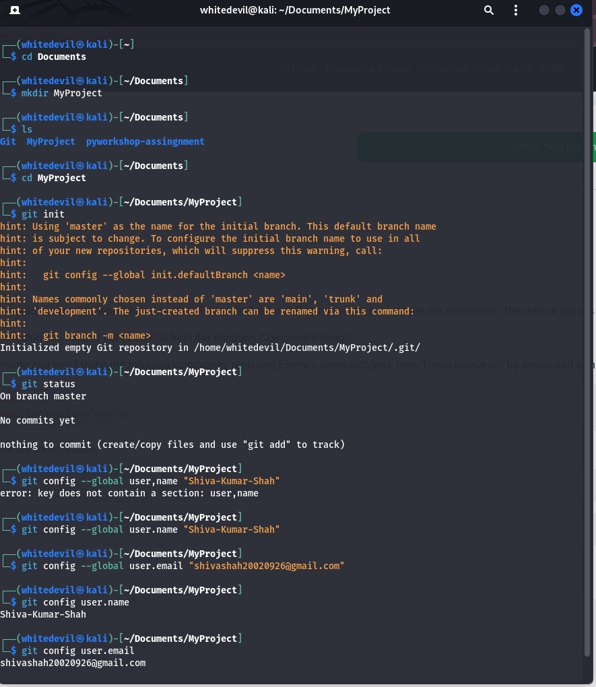

## SECOND ASSINGNMENT OF GIT AND GITHUB
- ASSINGNMENT2:

```bash
git init
git config --global user.name "your name"
git config --global user.email "your email"
git config user.name
git config user.email
git status
git add "file name"
git commit -m "commit message"
git status
git log
git log -online
git branch <branch-name>
git switch <branch-name>
git switch <Main-branch>
git merge <branch-name>
git status

### Screenshort


